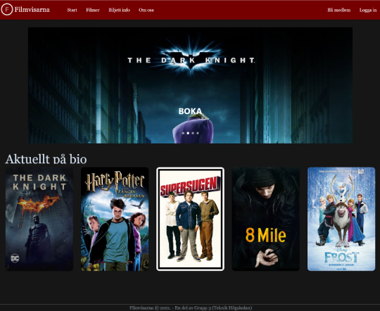
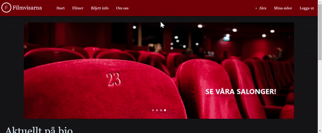
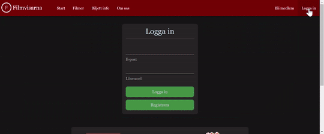

## Filmvisarna (Cinema booking system)

School project done in a team enviroment using **Scrum** methodology.

Full stack booking system for a Cinema with log in authentication.
All data is saved in JSON format, the backend server is run with Java Express and frontend is done using Vue Framework

### Features:
* My pages (when logged in)
* Search bar
* Carousel
* Authentication with SHA3-256 Hashing
* Seat map with sensitive input field(s)
* Embeded data
* Proxy (for handling chairs booked at the same time)
* Fully mobile-friendly website

### General look of the Website:

### Carousel:

### Login + My Pages with previous bookings

### Mobile-friendly responsive design

